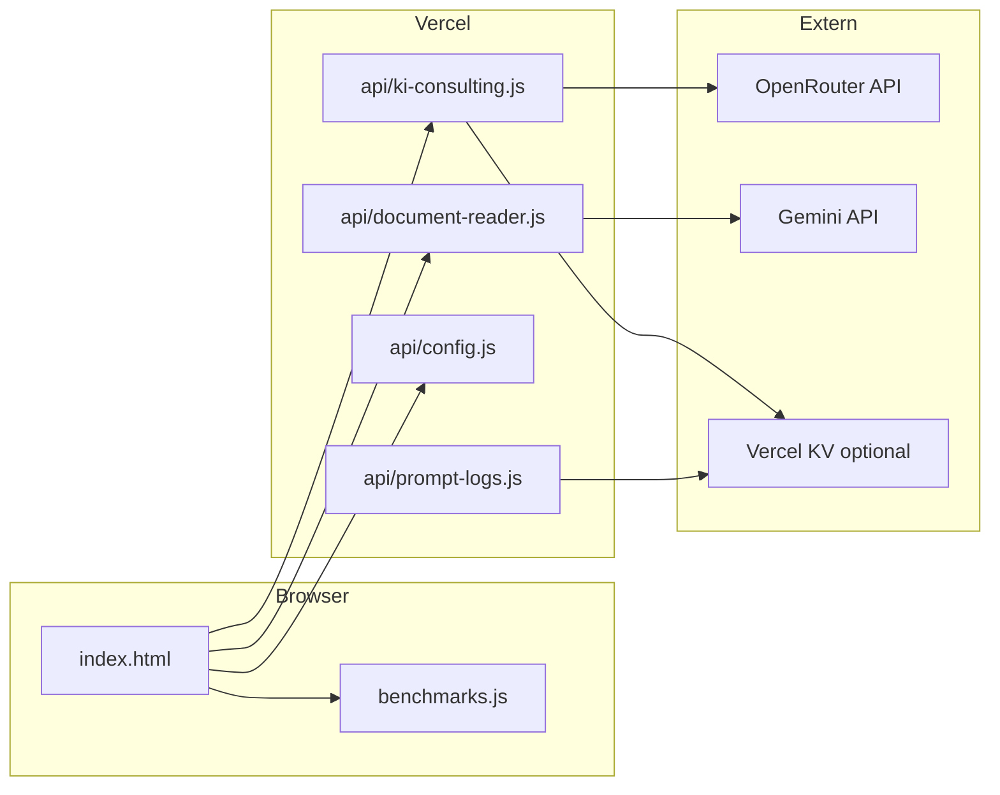

# Architektur-Übersicht

**Quellen:** `memory/long_term.md`, `AGENTS.md`, `README.md`

## Schichten

## Design-Prinzipien (AGENTS.md)

- Single-File-Frontend: `index.html` (Vanilla HTML/CSS/JS)
- Kein Build-Step für die App
- Benchmark-Daten: `benchmarks.js`
- API-Keys für Produktion nur serverseitig (OpenRouter, Gemini)

## Prompt-Engineering (parallel)

Verzeichnis `prompts/` — Stages, Personas, Agent-Runs, Scorecards.

Siehe [AGENTS.md & Personas](../agentic/agents-workflow.md).

## Dokumentations-Artefakte

| Ort | Rolle |
|-----|--------|
| `README.md` | Einstieg Entwickler |
| `docs/` (MkDocs) | Strukturierte Doku |
| `memory/` | Agent-Handover |
| `logs/` | Session-Protokoll |
| `known-issues.md` | Fachliche Benchmark-Grenzen |
